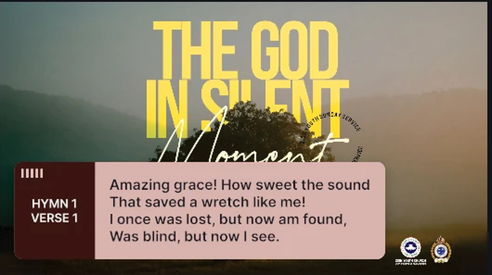
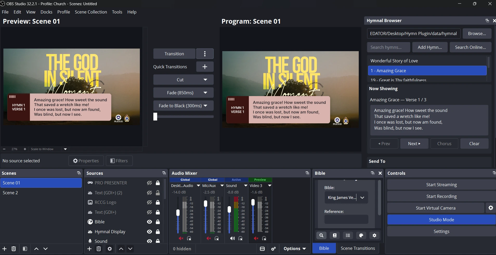

# Hymnal for OBS Studio

Put hymn lyrics on screen from inside OBS. Hymnal adds a **Hymnal Browser** dock
for picking a hymn and stepping through its verses, and a **Hymnal Display**
source that renders the current verse inside a clean lower-third overlay —
rounded panel, drop shadow, and a reference box that reads `HYMN 137 / VERSE 4`.

Built for church livestreams, but it works for any lyric or responsive-reading
display.



## Features

- **Hymnal Browser dock** — searchable hymn list, Previous / Next / Chorus /
  Clear controls, live preview of what's on screen, and Left / Center / Right
  justification buttons.
- **Hymnal Display source** — wraps OBS's own text renderer, so fonts, sizes and
  anti-aliasing behave exactly like a normal Text source.
- **Design overlay** — five one-click colour themes (Rose, Ivory & Bronze,
  Midnight & Gold, Slate & Sky, Forest & Amber), plus full control over panel
  and box colours, opacity, corner radius, padding and shadow. Turn it off and
  you get plain text again.
- **Hymn library on disk** — each hymn is a small JSON file in a folder you
  choose, so your library is easy to back up, edit and share.
- **Add hymns three ways** — type them in, import from
  [hymnal.net](https://www.hymnal.net) via *Search Online…*, or drop JSON files
  into the folder.
- Drives one or every Hymnal Display source in your scene collection.

## Requirements

- OBS Studio **31.0 or newer** (tested on 31.x and 32.x).
- Windows x64 builds are provided in [Releases](../../releases). macOS and
  Linux builds are produced by CI but have had less testing — reports welcome.

## Install

### Windows

1. Download the latest `obs-hymnal-*-windows-x64.zip` from
   [Releases](../../releases).
2. Close OBS.
3. Extract the zip. It contains a single `obs-hymnal` folder; move that folder
   into `C:\ProgramData\obs-studio\plugins\` (create `plugins` if it doesn't
   exist — paste `%ProgramData%\obs-studio` into Explorer's address bar to get
   there). You should end up with
   `C:\ProgramData\obs-studio\plugins\obs-hymnal\bin\64bit\obs-hymnal.dll`.
   No administrator rights are needed for this location.
4. Start OBS. **Hymnal Browser** appears under the *Docks* menu, and
   **Hymnal Display** under *Add Source*.

To update, close OBS and replace the `obs-hymnal` folder with the new one. Your
hymn folder and settings live elsewhere and are untouched.

### macOS / Linux

Grab the `.pkg` (macOS) or `.deb` (Ubuntu 24.04) from
[Releases](../../releases) and install it like any other OBS plugin package.

## Using it



1. Add a **Hymnal Display** source to your scene and position it where you want
   the lower third. Pick a theme under *Design Overlay* in its Properties, or
   untick the group for plain text.
2. Open **Docks → Hymnal Browser**. On first run it creates a hymn library for
   you and fills it with the sample hymns in [`data/hymnal`](data/hymnal), so
   there is something to click straight away. The folder is shown at the top of
   the dock; use **Browse…** to point at a different one (a shared drive, for
   instance) at any time.
3. Select a hymn. Verse 1 goes on screen immediately; use **Next / Previous /
   Chorus** to move through it and **Clear** to blank the display.
4. **Send To** lets you target every Hymnal Display source at once or a specific
   one; **Justify** sets the text alignment on the target.

If the dock ever ends up floating, drag its title bar onto any edge of the OBS
window, or press the **Dock into OBS** button that appears at the top of the
panel while it is undocked.

### Where hymns are stored

The default library lives beside OBS's own settings, so it survives plugin
updates and needs no special permissions:

| Platform | Location |
|----------|----------|
| Windows  | `%APPDATA%\obs-studio\plugin_config\obs-hymnal\hymnal\` |
| macOS    | `~/Library/Application Support/obs-studio/plugin_config/obs-hymnal/hymnal/` |
| Linux    | `~/.config/obs-studio/plugin_config/obs-hymnal/hymnal/` |

Back it up by copying the folder. To share a library across machines or
operators, put it on a synced/shared drive and point **Browse…** at it.

### Hymn file format

One JSON file per hymn, any file name, in the folder you picked:

```json
{
  "number": 260,
  "title": "There shall be showers of blessing",
  "author": "Daniel W. Whittle",
  "verses": [
    "There shall be showers of blessing:\nThis is the promise of love;\nThere shall be seasons refreshing,\nSent from the Savior above.",
    "There shall be showers of blessing—\nPrecious reviving again;\nOver the hills and the valleys,\nSound of abundance of rain."
  ],
  "chorus": "Showers of blessing,\nShowers of blessing we need:\nMercy-drops round us are falling,\nBut for the showers we plead."
}
```

`number`, `author` and `chorus` are optional. Line breaks inside a verse are
`\n`. See [`data/hymnal/_TEMPLATE.json.example`](data/hymnal/_TEMPLATE.json.example).

## Building from source

The project uses the standard
[OBS plugin template](https://github.com/obsproject/obs-plugintemplate) layout,
so its [build documentation](https://github.com/obsproject/obs-plugintemplate/wiki)
applies. In short, with CMake 3.28+ and a supported compiler installed:

```bash
cmake --preset windows-x64          # or macos / ubuntu-x86_64
cmake --build --preset windows-x64
```

On Windows the `windows-x64` preset targets Visual Studio 2022; use
`windows-x64-vs2026` if you only have Visual Studio 2026. OBS and Qt
dependencies are downloaded automatically on the first configure. The finished
plugin lands in `build_x64/rundir/RelWithDebInfo/`.

Pushing a git tag (for example `0.2.0`) makes GitHub Actions build Windows,
macOS and Linux packages and attach them to a draft release.

### Notes for contributors

- `src/hymnal-source.c` — the display source: wraps `text_gdiplus` /
  `text_ft2_source` and draws the overlay with `data/overlay.effect`.
- `src/hymnal-dock.cpp` — the Qt dock.
- `src/hymnal-net-client.cpp` — hymnal.net search/import.
- `data/qtplugins/tls/qschannelbackend.dll` — Qt's Windows TLS backend, which
  OBS's own Qt build does not ship; the plugin adds it to Qt's library path so
  HTTPS requests to hymnal.net work. It is unmodified and LGPL-licensed.

## License

Copyright © 2026 ElzenithoX. GPL-2.0 — see [LICENSE](LICENSE). Sample hymns in `data/hymnal` are public
domain.
